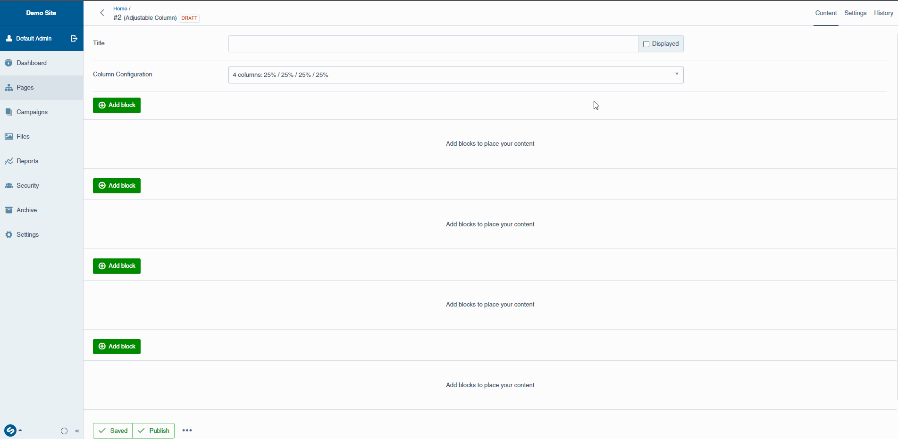

# Silverstripe Elemental Rows

## Introduction

This module is an extension to the [Silverstripe Elemental](https://github.com/silverstripe/silverstripe-elemental) module, allowing users to have up to 4 columns on one page.

Currently supported:

* Choices of columns (fixed options)
* Multiple elemental areas on a page (up to 4)

Each column type has it's own template.

## Requirements

* Silverstripe CMS ^4.9
* Silverstripe Elemental ^4.8

Templates are based on Bootstrap 5 grid system, but can be overriden to suit your own CSS styling.

## Installation

The recommended method to install the module is through Composer:

`composer require roseblade/silverstripe-elemental-rows`

## Available Columns

At the moment, there are a set number of column options. Changing these will adjust the editor to show a matching number of elemental areas. The columns are currently fixed.

## Bugs and Issues

Please [create an issue](https://github.com/RosebladeMedia/silverstripe-elemental-rows/issues) for any bugs or issues you experience, or any features you'd like to see. Pull requests are welcome.

## To-do

* Make the column options flexible through config
* Add visual examples of the columns within the CMS
* If possible, allow child elements to be moved between columns

## Credit

Module developed by [Roseblade Media](https://roseblade.media), a Welsh based Marketing Agency.
